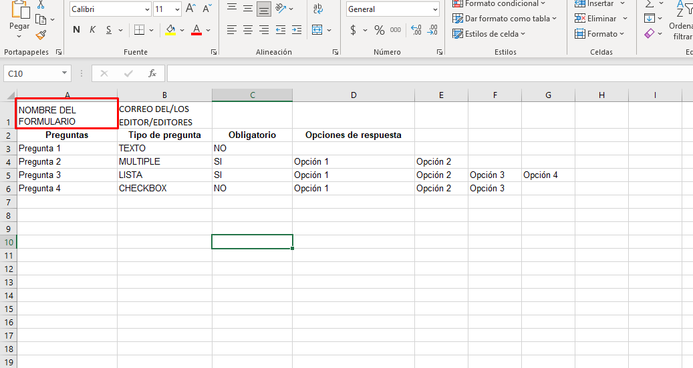

# Crear formulario de Google a partir de un Excel.

_Subimos el archivo XLS o XLSX a google Drive de la cual lo convierte a un formato de google Sheets. De lo cual con GS(Google Script) se genera el formulario y muestra la URL del formulario creado. Para ello debemos seguir las reglas que debe contener el excel para su creación correctamente._

### Pre-requisitos 📋

* Cuenta de google
* Descargar la plantilla de [Drive](https://drive.google.com/file/d/1o2gaD6GY252wknrc1DEf4dBICZdQOm9A/view?usp=sharing)

### Explicación de la plantilla 📌
La plantilla es un archivo en excel el cual debe estar correctamente ordenado para poder crear el formulario sin ningún error. Es por ello que aquí explico paso por paso como llenarla.

* _En la primera posición de Fila 1, Columna 1 se ingresará el titulo que llevará el formulario_

### Instalación 🔧

_1.- Ir a la plataforma de google de [Script](https://script.google.com) y le damos en Start Scripting e iniciamos sesion con la
cuenta de Google sino hemos iniciado_

_2.- Dar clic en Nuevo proyecto y si te aparece del lado derecho un boton con la leyenda "Usar el editor antiguo", darle clic ahí_

_3.- Vamos a desactivar la tecnologia de Chrome V8 ya que con ella sube los archivos a Drive rotos,
 para ellos vamos al menu Ejecutar>Inhabilitar el nuevo tiempo de ejecución de Apps Script con tecnología de Chrome V8_
 
_4.- Tendremos que habilitar los servicios avanzados de google. Vamos al menu Recursos>Servicios avanzados de Google y te 
pedirá aceptar las Condiciones de servicio de Cloud Console, damos clic y las aceptamos_

_5.- Copiamos todo el código de [CrearFormulario](https://github.com/hamdelg11/CrearFormularios/blob/main/CrearFormulario.gs) y lo
sustituimos por el código creado en automático de myFuction()_

_6.- Creamos un archivo HTML, vamos al menu Archivo>Nuevo>Archivo HTML y sustituimos el código creado en automático por
[index GAS](https://github.com/hamdelg11/CrearFormularios/blob/main/index%20GAS.html)_

_7.- Ya solo faltaría imprementarlo como aplicación web. Vamos ahora al menu Publicar>Implementar como aplicación web
en la sección Who has access to the app escogemos a nuestra preferencia quien pueda acceder a ella, damos clic en deploy
y nos arrojará el link a nuestra aplicación web._
